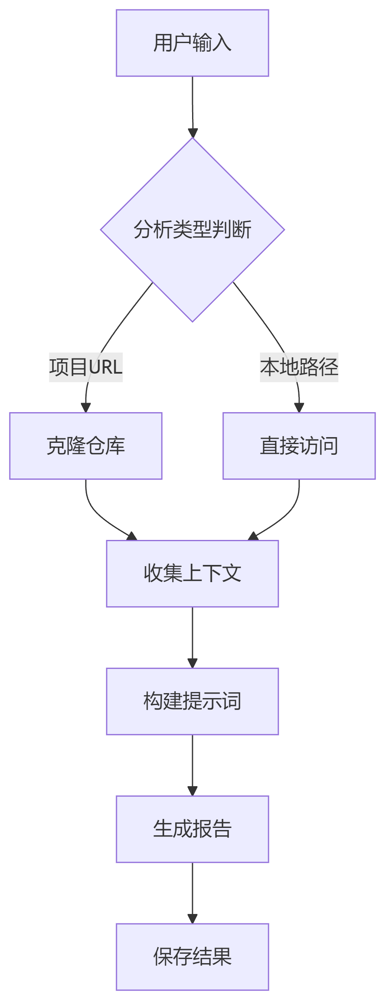
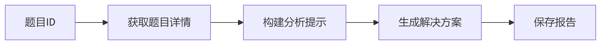

# code_analysis 项目文档

## 项目概述
**code_analysis** 是一个基于LLM的通用软件工程代理系统，旨在通过自然语言指令执行复杂的软件工程工作流。项目提供了代码分析、项目架构解析和**LeetCode**题目解答等功能，能够自动化生成高质量的技术分析报告。

---

## 核心功能
- **项目分析**：支持远程Git仓库和本地项目的自动化分析
- **代码分析**：支持单个文件或代码片段的深度解析
- **LeetCode解答**：自动生成LeetCode题目的解决方案和分析报告
- **报告生成**：自动生成结构化的Markdown格式技术报告

---

## 模块架构

```text
code_analysis/
├── README.md            # 项目说明文档
│
├── reports/             # 生成报告存储 md格式
│
├── memory/              # 智能体执行存储
│ ├── __init__.py
│ ├── memory.py          # 记忆系统
│ └── memory.json        # 记忆数据文件
│
├── prompt_template/     # 提示词模板
│ ├── code.json          # 代码分析模板
│ ├── file_content.json  # 文件分析模板
│ ├── leetcode.json      # LeetCode模板
│ └── repo.json          # 仓库分析模板
│ 
├── agents/              # 主agent目录
│ ├── __init__.py
│ └── agent.py           # 主Agent类
│
├── tools/ # 工具集
│  ├── __init__.py
│  ├── leetcode_tools.py # LeetCode工具
│  ├── prompt_tools.py   # 提示词构建
│  ├── repo_tools.py     # 仓库工具
│  ├── report_tools.py   # 报告工具
│  └── tools_list.py     # 工具注册
│
├── main.py              # 测试示例
│
├── temp_repo/           # 临时仓库目录（运行时生成）
│
└── requirements.txt     # 依赖列表
```

---

### 1. Agent 核心模块 (`agent.py`)
```python
class Agent:
    def __init__(self, api_key: str, memory: Memory):
        self.api_key = api_key
        self.memory = memory

    def analyze_project(self, repo_url: str = None, file_path: str = None, code_snippet: str = None):
        # 实现项目分析工作流

    def analyze_leetcode_solution(self, question_id: int):
        # 实现LeetCode解答工作流
```

---

### 2. Memory 记忆模块 
#### 2.1 记忆系统实现(memory.py)
```python
class Memory:
    def __init__(self, memory_folder="memory", memory_file="memory.json"):
        # 初始化记忆存储

    def add_thought(self, thought: str):
        # 记录思考过程

    def add_execution(self, action: str, result: str):
        # 记录执行结果       
```

#### 2.2 记忆存储(memory.json)
```python
{
    "thoughts": [
        {
            "timestamp": "2025-07-26 06:27:56",
            "thought": "正在分析项目: https://gitee.com/ByteDance/trae-agent"
        },
        {
            "timestamp": "2025-07-26 06:27:56",
            "thought": "克隆 Git 仓库到 ./temp_repo"
        },
        {
            "timestamp": "2025-07-26 06:28:00",
            "thought": "读取文件内容"
        },
        ...
    ],
    "executions": [
        {
            "timestamp": "2025-07-26 06:28:00",
            "action": "克隆仓库",
            "result": "成功克隆到 ./temp_repo"
        },
        {
            "timestamp": "2025-07-26 06:28:00",
            "action": "读取文件",
            "result": "成功读取文件内容"
        },
        {
            "timestamp": "2025-07-26 06:29:28",
            "action": "克隆仓库",
            "result": "成功克隆到 ./temp_repo"
        },
        ...
    ]
}
```


---

### 3. 工具模块系统
#### 3.1 仓库工具 (repo_tools.py)
```python
def clone_repo(repo_url: str, clone_dir: str):
    # 实现Git仓库克隆

def collect_repo_context(repo_root: str = None, file_path: str = None, code_snippet: str = None):
    # 收集项目上下文信息
```



#### 3.2 LeetCode工具 (leetcode_tools.py)
```python
def get_problem_by_id(question_id):
    # 获取LeetCode题目详情
```



#### 3.3 报告生成系统 (report_tools.py)
```python
def generate_report(prompt: str, api_key: str):
    # 调用LLM生成报告

def save_report(content, question_id=None, question_title=None):
    # 保存分析报告
```

#### 3.4 提示词生成(prompt_tools.py)
```python
def build_prompt(context: dict, file_path=None, code_snippet=None, text=None):
    # 根据不同参数决定使用不同模板
```

#### 3.5 工具列表(tools_list.py)
```python
    class Tool:
        def __init__(self, name: str, func, description: str):
            self.name = name
            self.func = func
            self.description = description

    tools = [
        Tool(
            name="CloneRepo",
            func=clone_repo,
            description="克隆 Git 仓库到指定目录"
        ),
        ...
```

---

## 配置要求  
```text
# 依赖库：
python = 3.8
gitpython = 3.1.45
requests = 2.32.3
beautifulsoup4 = 4.13.4

# 其他基础库
os, json, datetime, shutil, re
```
---

## 使用示例
### 分析Git仓库
```python
agent = Agent(api_key="your_api_key", memory=Memory())
report = agent.analyze_project(repo_url="https://github.com/example/repo")
```

### 分析LeetCode题目
```python
solution = agent.analyze_leetcode_solution(question_id=42)
```
